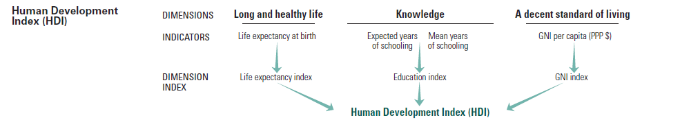

##Introduction
The United Nations has long been a champion for development and progress.
One way that progress is monitored is the use of the _Human Development Index_.

From the United Nations Development Programme web site for Human Development Reports: (http://hdr.undp.org/en/content/human-development-index-hdi)  


>The HDI was created to emphasize that people and their capabilities should be the ultimate criteria for assessing the development of a country, not economic growth alone. The HDI can also be used to question national policy choices, asking how two countries with the same level of GNI per capita can end up with different human development outcomes. These contrasts can stimulate debate about government policy priorities.
The Human Development Index (HDI) is a summary measure of average achievement in key dimensions of human development: a long and healthy life, being knowledgeable and have a decent standard of living. The HDI is the geometric mean of normalized indices for each of the three dimensions.
The health dimension is assessed by life expectancy at birth, the education dimension is measured by mean of years of schooling for adults aged 25 years and more and expected years of schooling for children of school entering age. The standard of living dimension is measured by gross national income per capita. The HDI uses the logarithm of income, to reflect the diminishing importance of income with increasing GNI. The scores for the three HDI dimension indices are then aggregated into a composite index using geometric mean.



The purpose of this script is to investigate the components and values of the Human Development Index by visualization.  


***


##Setup  

+ Read data   
+ Perform calculations (Reference: Training Material for Producing National Human Development Reports, March 2015)  
    + The life expectancy index is calculated using a minimum value of 20 years and a maximum value of 85 years.  
    + The education component of the HDI is measured by two indicators: mean years of schooling for adults aged 25 years and older, and the expected years of schooling for children of school-entering age.  The two indicators are first normalized using a minimum value of 0 and maximum value of 15 for mean years of schooling and 18 for expected years of schooling.  Both indicators are then combined to produce an education index, which is the arithmetic mean of the two (equally-weighted) sub-indices of education.  
    + The income component is measured using the natural logarithm of GNI per capita adjusted by PPP (purchasing parity, to adjust for differnt currencies). The minimum value is PPP=$100; the maximum value is set at PPP=$75,000.  
    + After calculating the indices for the three dimensions, the scores are aggregated into a composite index using a geometric mean, which is the cube root of the product of the three dimension indices.  
+ Check the calculations  


Note that the geometric mean was introduced in 2010, replacing the arithmetic mean.  This was in response to great criticism of the ability for one strong indicator to cancel out a weak one.  For this reason, both methods are calculated and compared in order to understand the magnitude of that possibility in this data set.


```{r Setup, echo=F, comment='>> '}
# Libraries
suppressPackageStartupMessages(library(pander, quietly=TRUE)) # for tables

#' Load lessR
suppressPackageStartupMessages(library(lessR))

#' Load ggplot2

suppressPackageStartupMessages(library(tidyverse))

#' Colors

suppressPackageStartupMessages(library(RColorBrewer))

#' Load lattice

suppressPackageStartupMessages(library(lattice))

# Human Development Index data
# Source: http://hdr.undp.org/en/data
# individual elements of HDI were combined into one file for selected year (2015)

HDI_Data <- Read("HDI integrated data 2015.xlsx", quiet=T)
cat("\nDetails of input HDI data file\n")
details(HDI_Data)

# Calculate the sub-indices and the HDI index, both geometric (to match input HDI) and arithmetic mean
HDI_Data <- HDI_Data %>%
  mutate(LExp_index=(Life_Exp-20)/(85-20)) %>%
  mutate(Educ_index=((Mean_School/15)+(ifelse(Exp_School>18,18,Exp_School)/18))/2 ) %>%
  mutate(GNI_index=(log(GNI_Cap)-log(100)) / (log(75000)-log(100)) ) %>%
  mutate(HDI_mean=round((LExp_index+Educ_index+GNI_index) /3,3) ) %>%
  mutate(HDI_calc=round((LExp_index*Educ_index*GNI_index) ^ (1/3),3) )

cat("\nSummary of HDI Data")
summary(HDI_Data)

# Create a tidy format
HDI_Data.tidy <- gather(HDI_Data, HDI_comp, HDI_value,
                        c(Life_Exp,Mean_School,Exp_School,GNI_Cap,HDI_UN,LExp_index,Educ_index,GNI_index,HDI_mean))

#-------- Track figure number s------------
FigNum=1

#-------- check the input v. the calculated HDI --------
style("darkred")
style(panel.fill="aliceblue", fit.color="red")
cat(paste("\nFigure",FigNum, ' - HDI Comparison'))
Plot(data=HDI_Data,c(HDI_UN,HDI_calc), fit="ls", main='HDI Comparison', sub=paste("Figure",FigNum)); FigNum=FigNum+1

# Compare the arithmetic and geometric means
cat(paste("\nFigure",FigNum, ' - HDI Calculation Method Comparison'))
Plot(data=HDI_Data,c(HDI_mean,HDI_calc), main='HDI Method Comparison', sub=paste("Figure",FigNum)); FigNum=FigNum+1


```

*** 

###Observations  

+ In Figure 1, one calculated point stands out relative to the input HDI value. It was investigated and verified no issue with input.  Conclude that the offest is likely due to different rounding performed by UN or possible an entry error in source.
+ As shown in Figure 2, the geometric mean and arithmetic mean values are strongly correlated for the year chosen. Other UN indices include more components (such as gender equality). These may have more influence on the arithmetic mean.  

*** 

##Overview of Regions and Countries in Data Set  
  


```{r 1, echo=F, comment='>> '}

# Look at the distribution of countries by region
cat(paste("Information: ",n_distinct(HDI_Data$Region),"Regions in Data Set"))
cat(paste("Information: ",n_distinct(HDI_Data$Country),"Countries in Data Set"))
n<-n_distinct(HDI_Data$Region)
Region_list <- data.frame(Region=unique(HDI_Data$Region),Count=1:n, AveHDI=1:n, stringsAsFactors = F)

Rindex=1
for(r in unique(HDI_Data$Region)) {
  Region_list[Rindex,2] <- as.numeric(n_distinct(filter(HDI_Data, Region==r)$Country))
  Region_list[Rindex,3] <- as.numeric(mean(filter(HDI_Data, Region==r)$HDI_UN))
  Rindex=Rindex+1
}

pander(Region_list, caption="Countries per Region and Average HDI", round=2)

```


*** 

###Observations  

+ The number of countries varies widely by region, with North America having only 2 and Sub-Saharan Africa 47 countries.  
+ The average HDI ranges from 0.5 in Sub-Saharan Africa to 0.9+ in North America.
+ Central African Republic had the lowest HDI in 2015, at 0.35  


##Bar Charts and Histograms

```{r 2, echo=F, comment='>> '}

# Region_list

# Using ggplot function. First list the name of the data table, then invoke the
# aes function, for aesthetics, to specify the names of the x-variable and the
# y-variable. Then add the layer that specifies the type of geometric object to
# plot with the geom_bar function. The stat="identity" argument informs ggplot
# to not tabulate the data, but instead directly plot the data values.

# flip the chart because of the long names
ggplot(Region_list, aes(Region, Count)) + geom_bar(stat="identity",fill="darkblue") + coord_flip() +
  ggtitle(paste("Figure",FigNum,"- Number of Countries per Region")); FigNum=FigNum+1

# alternatively, abbreviate them
ggplot(Region_list, aes(Region, Count)) + geom_bar(stat="identity",fill="darkblue") + theme(axis.text.x = element_text(angle=45,  hjust=1)) +
  ggtitle(paste("Figure",FigNum,"- Alternate View of Number of Countries per Region")); FigNum=FigNum+1

cat("\n The horizontal lines in the following bar charts represent the mean HDI.")

# look at HDI for each country, by region
# (was not getting all plots at first; learned I need to use print(ggplot) to get output from within loop)
for(r in unique(HDI_Data$Region)) {
  mydata <- filter(HDI_Data, Region==r)
  yHDImean = round(mean(mydata$HDI_UN),2)
  title <- paste("Figure",FigNum," - UN HDI for Countries in Region",r);FigNum=FigNum+1
  subtitle <- (paste("   Mean HDI=",yHDImean))
  print(ggplot(mydata, aes(Country, HDI_UN)) + geom_bar(stat="identity",fill="orange") + 
        theme(axis.text.x = element_text(angle=45,hjust=1)) + labs(title=title, subtitle=subtitle) +
        scale_y_continuous(limits = c(0,1)) + geom_hline(aes(yintercept = yHDImean)))
}

# for histograms, iterated on binwidth - not expecting a smooth distribution for this dataset
ggplot(HDI_Data, aes(HDI_UN)) + geom_histogram(position="identity", fill="darkblue", colour="yellow", binwidth=0.06) +
  stat_bin(binwidth=0.06, geom="text", colour="yellow", size=3.5, aes(label=..count..), position=position_stack(vjust=0.5)) +
  ggtitle(paste("\nFigure",FigNum,"- Histogram of Human Development Index for All Regions")); FigNum=FigNum+1


# HDI distribution by region - Sub-Saharan Africa at minimum
ggplot(HDI_Data, aes(HDI_UN, color=Region, fill=Region)) +
  geom_histogram(position="identity", binwidth=0.06, alpha=0.35) +
  ggtitle(paste("\nFigure",FigNum,"- Histogram of Human Development Index by Region")); FigNum=FigNum+1

# make facets to see each region more clearly
ggplot(HDI_Data, aes(HDI_UN)) +
  geom_histogram(binwidth=0.06,fill="darkblue",colour="yellow") + facet_wrap(~ Region) +
  ggtitle(paste("\nFigure",FigNum,"- Histogram of Human Development Index by Region")); FigNum=FigNum+1


```

###Observations  

+ Figures 3 and 4 visualize the number of countries per region.  
+ Figures 5 through 16 provide a comparison of the Human Development Index by Region.  The horizontal line is the mean of the HDI for all the countries in the region.
+ Figure 17 is a histogram of the UN HDI. Iteration on the bin width in the range 0.01 and up yielded 0.06 as a fairly smooth representation that captures the tails of the distribution.  
+ Figure 18 is a histogram of the UN HDI across all the regions.  Here the 'double hump' between the underdeveloped and developed regions is clearly visible.  
+ Figure 19 divides the histogram by Region.  Details of difference between highly developed regions - Europe or North America for example - and the least developed region: Sub-Saharan Africa are obvious. The consistent scale is key to this comparison.  


###Scatter Plots  

Investigate the components of HDI  


```{r 3, echo=F, comment='>> '}

ggplot(HDI_Data, aes(GNI_Cap, Life_Exp)) + geom_point(aes(color=Region)) +
  ggtitle(paste("\nFigure",FigNum,"- Income and LIfe Expectancy Components of HDI")); FigNum=FigNum+1

# it is difficult to distinguish between the Regions using the default color palette
# create a custome color list of the appropriate length for this data set

#display.brewer.all()

colourCount <- n_distinct(HDI_Data$Region)
getPalette = colorRampPalette(brewer.pal(8, "Dark2"))

ggplot(HDI_Data, aes(GNI_Cap, Life_Exp)) + geom_point(aes(color=Region)) +
        scale_colour_manual(values = getPalette(colourCount)) +
        ggtitle(paste("Figure",FigNum,"- Income and Life Expectancy Components of HDI")); FigNum=FigNum+1

# include the relative values of education index, the third component of HDI
ggplot(HDI_Data, aes(GNI_Cap, Life_Exp)) + geom_point(aes(color=Region,size=Educ_index)) + 
  scale_colour_manual(values = getPalette(colourCount)) +
  ggtitle(paste("Figure",FigNum,"- Income, Life Expectancy and Education Components of HDI")); FigNum=FigNum+1

# take a closer look at the least developed region, Sub-Saharan Africa

ggplot(filter(HDI_Data,Region=="Sub-Saharan Africa"), aes(GNI_Cap, Life_Exp)) + geom_point(aes(color=Educ_index),size=5) +
  ggtitle(paste("Figure",FigNum,"- Components of HDI in Sub-Saharn African Countries")); FigNum=FigNum+1


# Box plots
# use tidy format
mydata <- filter(HDI_Data.tidy,HDI_comp=="HDI_UN" | HDI_comp=="GNI_index" | HDI_comp=="Educ_index" | HDI_comp=="LExp_index" )

# compare the elements of HDI index with the aggregate index
ggplot(mydata, aes(x=HDI_comp,y=HDI_value)) + geom_boxplot(fill="steelblue1",notch=T) +
  ggtitle(paste("Figure",FigNum,"- Distribution of HDI Components")); FigNum=FigNum+1

```

###Observations  

+ Figures 20 and 21 present two components of the HDI - the only difference is the color scheme selected to help distinguish between the 
regions.  One outlier is clearly visible here: Qatar has the highest gross national income per capita by far of any nation.  
+ In Figure 22, the third dimension of HDI is incorporated via the Education Index as point size. There is a general trend for that index to be larger at the higher levels of income.  
+ Figure 23 explores the Sub-Saharan Africa region. Here, the correlation between income and life expectancy is less apparent.  

***

####Correlation  

Investigate the correlation between elements of HDI

```{r 4, echo=F, comment='>> '}

cat(paste("\nFigure",FigNum,' - HDI Correlation'))
Plot(data=HDI_Data,c(HDI_UN,LExp_index,Educ_index,GNI_index), fit="ls", main='HDI Correlation', sub=paste("Figure",FigNum)); FigNum=FigNum+1


# look at HDI component orrelation by region
for(r in unique(HDI_Data$Region)) {
  
  mydata <- filter(HDI_Data, Region==r)
  if (n_distinct(mydata$Country)>2) {
    title <- paste("\nFigure",FigNum," - UN HDI Correlation for Region:",r);FigNum=FigNum+1
    cat(title);   cat(paste("\nNumber of Countries =", n_distinct(mydata$Country)))
    Plot(data=mydata,c(HDI_UN,LExp_index,Educ_index,GNI_index), fit="ls", main=title)
  } else {
    cat(paste0(">> Insufficient Countries (",n_distinct(mydata$Country),") in Region ",r," for Correlation Analysis"))

  }

}


```

###Observations  

+ As seen previously in the scatter plots, there is fairly strong correlation of HDI with its components for all the Regions in aggregate. This is illustrated in Figure 24.  
+ We observed a weaker correlation in Sub-Saharan Africa.  Figures 25-36 contain the correlations by Region. Note that NOrth America, with 2 countries, has insufficient data for correlation analysis.

## Conclusion

Visualization of the United Nations' Human Development Inedex components, and sub-indices yielded greater understanding. The profound difference between highly developed and develping regions was illustrated. It was also shown that other factors - policy, conflict and others not represented in the index - are affecting the outcomes of education and life expectancy even when wealth levels are higher.


 
